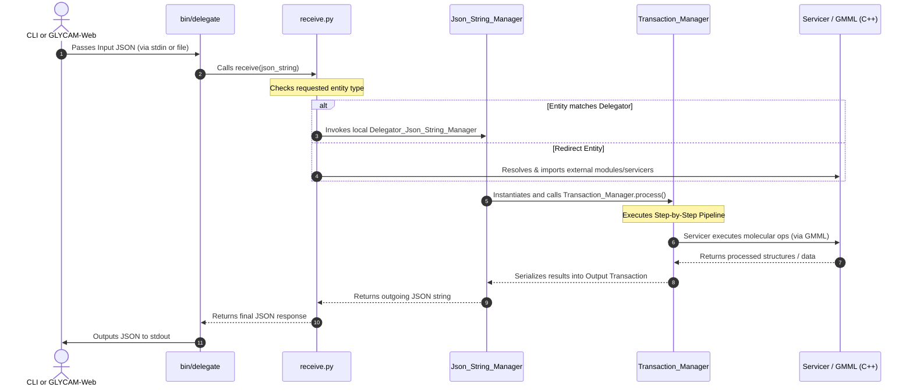

# GEMS Architecture and Data Flow

This document details the architectural design and data flow of the GLYCAM Extensible Modeling Scripts (GEMS) project.

The initial draft of this document was written by Gemini AI.

---

## 1. Architectural Overview

GEMS serves as a pipeline-oriented Python wrapper around the C++ **Glycam Molecular Modeling Library (GMML)**. It is structured around the following design patterns:

- **JSON Input/Output**: Standardized JSON objects are parsed and validated using Python's `pydantic` library to enforce strict request/response schemas.
- **Delegation Router**: A central delegator intercepts requests, determining if they can be handled locally or need redirection to specialized modules.
- **Transaction Pipeline**: Execution flow is handled by custom `Transaction_Manager` subclasses, keeping configuration, execution, and output generation decoupled.
- **C++ Native Layer Integration**: Low-level, computationally intensive molecular modeling and analysis are executed by the C++ GMML library via SWIG-generated bindings (`gmml` / `gmml2`).

---

## 2. System Sequence Diagram

The high-level lifecycle of a modeling request is illustrated in the diagram below:

---

## 3. The Transaction Pipeline Step-by-Step

When a transaction is processed by the `Transaction_Manager` (`gemsModules/common/transaction_manager.py`), data progresses through five distinct steps:

### A. Request Processing (`manage_requests`)
- **Input**: Raw JSON dict.
- **Operation**: Parsed into a standard python `Transaction` model. Request parameters are checked against their schema constraints.
- **Output**: A list of **Action Associated Objects (AAOP)**.

### B. Graph Generation (`generate_aaop_tree_pair`)
- **Input**: List of AAOPs.
- **Operation**: Formulates a tree pair containing a **Request Tree** (detailing requested changes) and a blank/template **Response Tree**.
- **Output**: `AAOP_Tree_Pair`.

### C. Project Management (`manage_project`)
- **Input**: Incoming configuration.
- **Operation**: Registers file output paths, prepares target logs directories, and writes debug files (`request-raw.json` and `request-initialized.json`).

### D. Servicer Execution (`invoke_servicer`)
- **Input**: `AAOP_Tree_Pair`.
- **Operation**: The request tree is processed by a registered `Servicer`. The servicer invokes native C++ GMML calls via SWIG bindings to perform structural computations.
- **Output**: An updated `AAOP_Tree_Pair` with completed response data.

### E. Response Serialization (`manage_responses` & `update_transaction`)
- **Input**: Processed `AAOP_Tree_Pair`.
- **Operation**: Transcribes the response tree back into standard response entities, logs the final response metadata to `response.json`, and yields the output JSON response payload.
